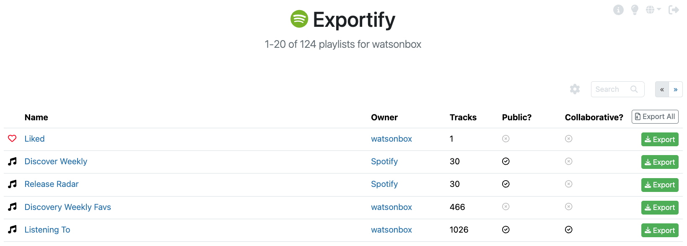

<a href="https://kirara2025kira-maker.github.io/exportify-2026-junio/"></a>

Exporta tus playlists de Spotify a **Excel (.xlsx)** haciendo clic en este enlace: [https://kirara2025kira-maker.github.io/exportify-2026-junio/](https://kirara2025kira-maker.github.io/exportify-2026-junio/).

Como muchos usuarios han notado, no hay forma de exportar/archivar/hacer copias de seguridad de las playlists desde el cliente de Spotify para su custodia. Esta aplicación proporciona una interfaz simple para hacerlo usando la [API Web de Spotify](https://developer.spotify.com/documentation/web-api/).

No se guardarán datos: toda la aplicación se ejecuta en el navegador.

## Características
⚙️ Inclusión opcional de datos de álbum, artista y características de audio en los archivos exportados  
🔍 Búsqueda de playlists con [sintaxis de búsqueda avanzada](#sintaxis-de-búsqueda-avanzada) y exportación de resultados  
🌓 Modo oscuro  
🗺 Disponible en 8 idiomas (Inglés, Francés, Español, Italiano, Alemán, Portugués, Sueco y Holandés)  
📱 Compatible con dispositivos móviles  
ℹ Ayuda de referencia rápida  
🚀 [Manejo avanzado de limitación de tasa](https://github.com/watsonbox/exportify/pull/75) para exportaciones rápidas  
👩‍💻 Stack de desarrollo moderno basado en [React](#stack) + suite de pruebas  

## Uso
1. Abre [la aplicación](https://kirara2025kira-maker.github.io/exportify-2026-junio/)
2. Haz clic en 'Comenzar'
3. Otorga a Exportify acceso de solo lectura a tus playlists
4. Haz clic en el botón 'Exportar' para exportar una playlist como archivo `.xlsx`
5. Haz clic en 'Exportar todo' para guardar un archivo zip que contiene un archivo **Excel (.xlsx)** por cada playlist en tu cuenta. Esto puede tardar un tiempo cuando hay muchas playlists y/o son grandes.

## Reimportar Playlists
Una vez guardadas las playlists, también es bastante sencillo volver a importarlas a Spotify. Abre el archivo **XLSX** en Excel, selecciona y copia los URIs `spotify:track:xxx`, luego simplemente crea una playlist en Spotify y pégalos. Esto solo ha sido probado con la aplicación de escritorio.

## Formato de Exportación
Los datos de las pistas se exportan en formato **Excel (.xlsx)** con los siguientes campos del [objeto de pista de Spotify](https://developer.spotify.com/documentation/web-api/reference/get-several-tracks):
- URI de la pista
- Nombre de la pista
- URI(s) del artista
- Nombre(s) del artista
- URI del álbum
- Nombre del álbum
- URI(s) del artista del álbum
- Nombre(s) del artista del álbum
- Fecha de lanzamiento del álbum
- URL de la imagen del álbum (típicamente 640x640px jpeg)
- Número de disco
- Número de pista
- Duración de la pista (ms)
- URL de vista previa de la pista (mp3)
- ¿Explícita?
- Popularidad
- ISRC ([Código Internacional Estándar de Grabación](https://isrc.ifpi.org/en/))
- Es reproducible - si la pista se puede reproducir en el [mercado del usuario](https://developer.spotify.com/documentation/web-api/concepts/track-relinking)
- Añadido por
- Añadido el

Al hacer clic en el engranaje, se pueden exportar datos adicionales.
<a href="https://kirara2025kira-maker.github.io/exportify-2026-junio/"></a>

Al seleccionar "Incluir datos de artistas", se añadirán los siguientes campos del [objeto de artista de Spotify](https://developer.spotify.com/documentation/web-api/reference/get-multiple-artists):
- Géneros del artista

Y al seleccionar "Incluir datos de características de audio", se añadirán los siguientes campos del [objeto de características de audio de Spotify](https://developer.spotify.com/documentation/web-api/reference/get-several-audio-features):
- Danzabilidad, Energía, Tonalidad, Volumen, Modo, Habladuría, Acústica, Instrumentalidad, Vivacidad, Valencia, Tempo, Compás

Adicionalmente, al seleccionar "Incluir datos del álbum", se añadirán los siguientes campos del [objeto de álbum de Spotify (completo)](https://developer.spotify.com/documentation/web-api/reference/get-an-album):
- Géneros del álbum, Sello discográfico, Derechos de autor

*Ten en cuenta que cuantos más datos se exporten, más tiempo tardará la exportación.*

## Búsqueda de Playlists
Si estás buscando una playlist específica para exportar, puedes usar la función de búsqueda para encontrarla rápidamente por nombre:
<a href="https://kirara2025kira-maker.github.io/exportify-2026-junio/"></a>

La búsqueda no distingue entre mayúsculas y minúsculas. Los resultados de búsqueda se pueden exportar como archivo zip haciendo clic en "Exportar resultados".

> [!WARNING]  
> Ten en cuenta que si tienes un número muy grande de playlists, puede haber un pequeño retraso antes de que aparezcan los primeros resultados de búsqueda, ya que la API de Spotify no permite buscar directamente, por lo que todas las playlists deben ser recuperadas primero.

### Sintaxis de Búsqueda Avanzada
Ciertas consultas de búsqueda tienen un significado especial:

| Consulta de búsqueda | Significado |
| --- | --- |
| `public:true` | Solo mostrar playlists públicas |
| `public:false` | Solo mostrar playlists privadas |
| `collaborative:true` | Solo mostrar playlists colaborativas |
| `collaborative:false` | No mostrar playlists colaborativas |
| `owner:me` | Solo mostrar playlists que poseo |
| `owner:[propietario]` | Solo mostrar playlists propiedad de `[propietario]` |

## Desarrollo
Este proyecto fue inicializado con [Create React App](https://github.com/facebook/create-react-app).

En el directorio del proyecto, primero ejecuta `npm install` para configurar las dependencias, luego puedes ejecutar:

`npm start`  
Ejecuta la aplicación en modo de desarrollo.  
Abre [http://localhost:3000](http://localhost:3000) para verla en el navegador.  
La página se recargará si haces ediciones. También verás cualquier error de lint en la consola.

`npm test`  
Inicia el ejecutor de pruebas en el modo interactivo de observación.

`npm run build`  
Construye la aplicación para producción en la carpeta `build`.

`npm run deploy`  
Despliega la aplicación en GitHub Pages.

## Stack
Además de [Create React App](https://github.com/facebook/create-react-app), la aplicación está construida usando las siguientes herramientas/librerías:
- [React](https://reactjs.org/) - Una librería de JavaScript para construir interfaces de usuario
- [Bootstrap 5](https://getbootstrap.com/) - Estilos y componentes de UI
- [Font Awesome 6](https://fontawesome.com/) - Conjunto de iconos vectoriales y toolkit
- [react-i18next](https://react.i18next.com/) - Framework de internacionalización
- [SheetJS (xlsx)](https://sheetjs.com/) - Generación de archivos Excel del lado del cliente
- [React Testing Library](https://testing-library.com/docs/react-testing-library/intro/) - Solución ligera para probar nodos DOM de React
- [MSW](https://mswjs.io/) - Simulación de peticiones a nivel de red

## Historial
- **2015**: Exportify [nace](https://github.com/watsonbox/exportify/commit/b284822e12c3adea8fb83258fdb00ec4690701e1)
- **2020**: [Lanzamiento importante](https://watsonbox.github.io/posts/2020/12/02/exportify-refresh.html) incluyendo búsqueda, artistas y características de audio, exportación de canciones favoritas, y un nuevo sistema de limitación de tasa
- **2024**: [Lanzamiento importante](https://watsonbox.github.io/posts/2024/09/04/exportify-updates.html) incluyendo modo oscuro, internacionalización y mejoras de búsqueda
- **2026**: Fork personalizado con exportación a **Excel (.xlsx)** y despliegue en GitHub Pages

## Notas
Según la [documentación](https://developer.spotify.com/web-api/working-with-playlists/) de Spotify: *"Las carpetas no se devuelven a través de la API Web en este momento, ni se pueden crear usándola"*. Lamentablemente, así es como es.

He [hecho todo lo posible](https://github.com/watsonbox/exportify/pull/75) para intentar eliminar los errores resultantes del uso excesivo de la API de Spotify. Sin embargo, exportar datos en masa es un proceso bastante intensivo en peticiones, así que por favor intenta usar esta herramienta de manera responsable. Si necesitas más capacidad, considera [crear tu propia aplicación de Spotify](https://github.com/watsonbox/exportify/issues/6#issuecomment-110793132) que puedas usar directamente con Exportify.

*Descargo de responsabilidad: Debería estar claro, pero este proyecto no está afiliado con Spotify de ninguna manera. Es solo una aplicación que usa su API como cualquier otra, con un nombre y logo atrevidos 😇.*

En caso de que no veas las playlists que esperabas ver y te des cuenta de que las has eliminado accidentalmente, en realidad es posible [recuperarlas](https://support.spotify.com/us/article/can-i-recover-a-deleted-playlist/).

## Monitoreo de Errores
Monitoreo de errores proporcionado por Bugsnag.  
<a href="http://www.bugsnag.com"></a>

## Ejecutar con Docker
Para construir y ejecutar Exportify con docker, ejecuta:
```bash
docker build . -t exportify
docker run -p 3000:3000 exportify